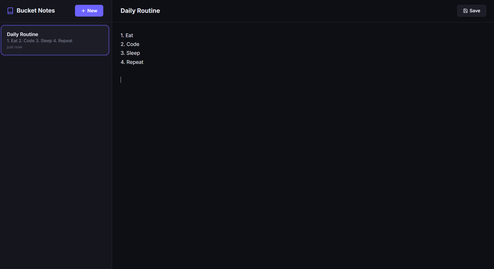

## Real-World Example: An Offline-First Note-Taking App

Enough theory. Let&apos;s build **Bucket Notes**, a functional offline-first note-taking app that uses Storage Buckets to manage persistence and durability.

