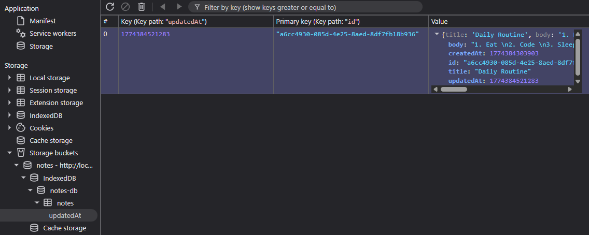

### Result: In-Browser Storage Isolation

Once the app is running, you can inspect the storage in Chrome DevTools (**Application > Storage > Storage Buckets**).

<BlogImage src="images/storage-bucket-initialized.png" alt="Storage Bucket Initialized in Chrome DevTools" align="center" />

When metadata and notes are saved, they are contained entirely within the `notes` bucket. If you check the IndexedDB section, you&apos;ll see it nested under this specific bucket, isolated from any other storage on the same origin.

