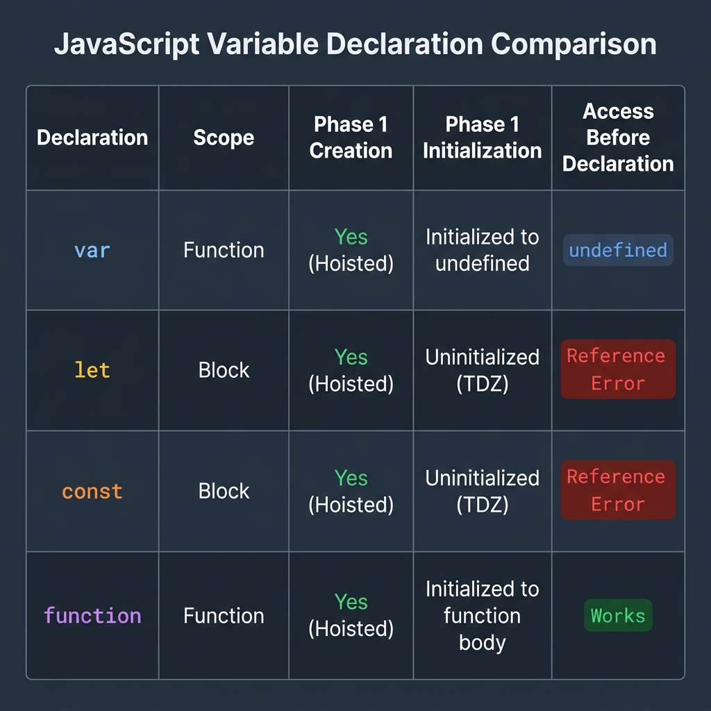

## The Full Comparison

{/* | Declaration | Scope | Created in Phase 1? | Initialized in Phase 1? | Value Before Declaration | Access Before Declaration |
| :--- | :--- | :---: | :---: | :---: | :--- |
| `var x = 5` | Function / Global | Yes | Yes (`undefined`) | `undefined` | Works (returns `undefined`) |
| `let x = 5` | Block | Yes | No | N/A (TDZ) | `ReferenceError` |
| `const x = 5` | Block | Yes | No | N/A (TDZ) | `ReferenceError` |
| `function f() {}` | Function / Global | Yes | Yes (function object) | Function object | Works (fully callable) |
| `var f = function() {}` | Function / Global | Yes | Yes (`undefined`) | `undefined` | `TypeError` (not a function) |
| `const f = function() {}` | Block | Yes | No | N/A (TDZ) | `ReferenceError` |
| `var f = () => {}` | Function / Global | Yes | Yes (`undefined`) | `undefined` | `TypeError` (not a function) |
| `const f = () => {}` | Block | Yes | No | N/A (TDZ) | `ReferenceError` | */}

As shown in the image above, the pattern is consistent: `var` always initializes to `undefined` during the creation phase, while `let` and `const` are left uninitialized. Function declarations are unique because they are assigned their full function object immediately. Everything else follows the specific variable keyword's rules.
